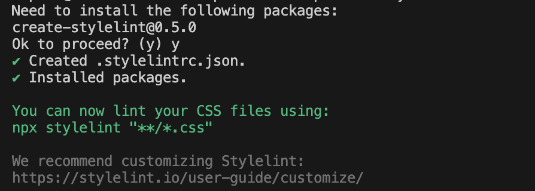
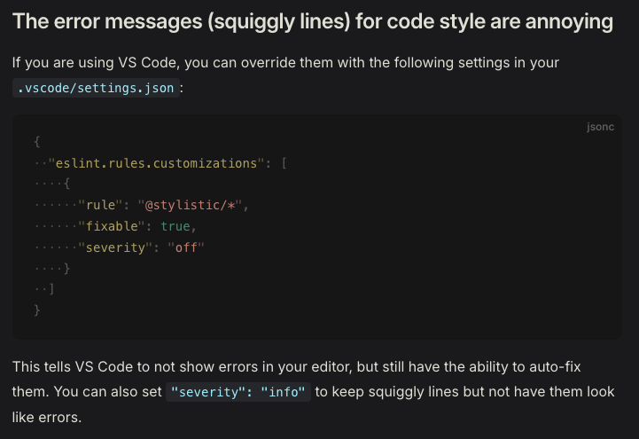
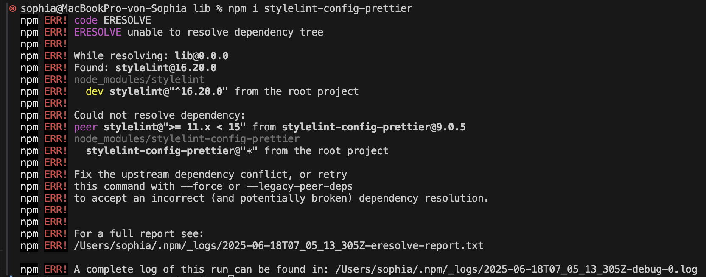
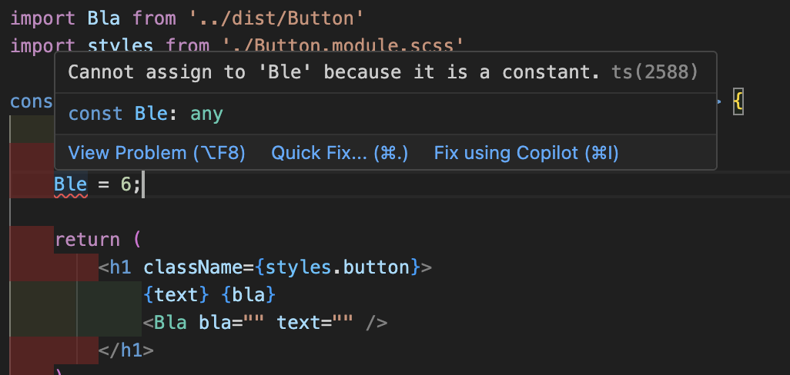
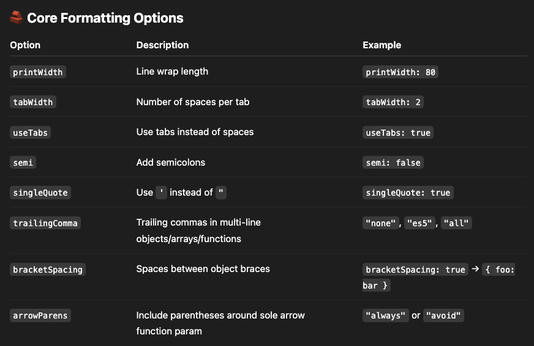
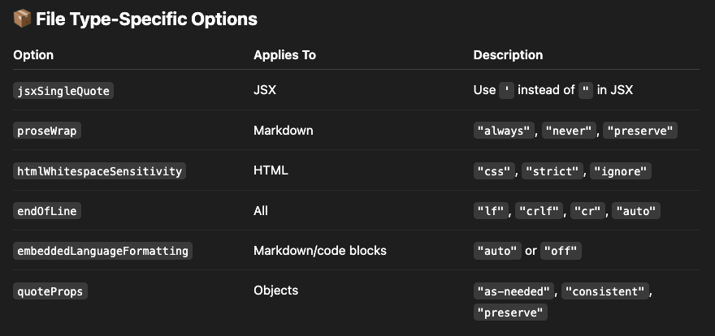

# Figuring out how to set up ESLint and Prettier (... and some more)

3 min read · June 3, 2023

## Difference between ESLint and Prettier

As this got me confused for a while I think I finally got the gist of how these two differ and complement each other. Bear with me, this is gonna be the longest post I've written so far, as it's pure exploration on my side with several tools.

### ESLint

ESLint is an open source project which statically analyzes your code to quickly find problems based on a set of rules which can be tailored to your liking in its config file. Its goal is to make your code more consistent and avoid bugs. It is built into most text editors and you can run ESLint as part of your integration pipeline. ESLint can also automatically fix many problems that you encounter and alter your code where possible.

ESLint is completely pluggable. Every single rule is a plugin and you can add more at runtime. You can also add community plugins, configurations, and parsers to extend the functionality of ESLint.

Fun fact: As I am German I learned that a linter is actually that thing here

It makes sense if you think about it, if you lint something all the fuzz (bugs, bad code practices) you don't want on your freshly steamed shirt (codebase) will stick to the linter (ESLint underlining no-nos or fixing them for you).

### Prettier

Formatters are tools that verify and correct whitespace issues in code, such as spacing and newlines. Formatters typically run very quickly because they are only concerned with changing whitespace, not code logic or naming.

Prettier is an opinionated code formatter with support for a bunch of different languages and frameworks like CSS, JSX, Typescript, etc. Prettier enforces a consistent code style (i.e. code formatting that won't affect the AST) across the entire codebase. It basically disgards the original styling by parsing it away and re-painting the parsed AST with its own rules that take the maximum line length into account, wrapping code when necessary.

```js
//Instead of this

foo(
    reallyLongArg(),
    omgSoManyParameters(),
    IShouldRefactorThis(),
    isThereSeriouslyAnotherOne()
);

//Prettier does this

foo(
    reallyLongArg(),
    omgSoManyParameters(),
    IShouldRefactorThis(),
    isThereSeriouslyAnotherOne()
);
```

What does opinionated mean in that context?

Prettier intentionally limits my choices. It provides very few configuration options on purpose. Its philosophy is: "You shouldn't waste time bikeshedding code style. Just pick one standard and stick to it."

Examples:

You can configure things like:

- printWidth (default: 80)
- tabWidth (default: 2)
- singleQuote: true | false
- semi: true | false

But you cannot configure things like:

- Where line breaks happen (beyond printWidth)
- Precise indent style for nested ternaries
- Wrapping behavior for long object literals

I also can’t enforce code structure rules (e.g., disallow unused vars, prefer arrow functions, no var, etc.).

This is where ESLint steps in to offer fine-grained control over everything style- and logic-related in JS/TS

I can configure:

- Code structure rules: no-unused-vars, no-console, no-debugger
- Style rules (if using stylistic plugins): indent, quotes, semi, etc.
- Complex rule sets: enforce specific naming conventions, restrict imports, require certain comments, etc.
- Levels: off, warn, error for each rule

I can also extend shareable configs (like Airbnb or Google), and even write my own plugins and rules.



## How ESLint works under the hood

(...)

## Setting up ESLint

First I run make sure that I have my package.json file present in the directory and then I run `npm init @eslint/config@latest`. It will prompt me with a few questions to set up the config file for me









The dialog helps to identify which packages I need to get up and running with ESLint for my needs and it does the installation and configuration of the config file which looks like this

```js
import js from '@eslint/js';
import globals from 'globals';
import tseslint from 'typescript-eslint';
import pluginReact from 'eslint-plugin-react';
import { defineConfig } from 'eslint/config';

export default defineConfig([
    {
        files: ['**/*.{js,mjs,cjs,ts,mts,cts,jsx,tsx}'],
        plugins: { js },
        extends: ['js/recommended'],
    },
    {
        files: ['**/*.{js,mjs,cjs,ts,mts,cts,jsx,tsx}'],
        languageOptions: { globals: globals.browser },
    },
    tseslint.configs.recommended,
    pluginReact.configs.flat.recommended,
]);
```

Let's go through each line one by one and explain what it does.

---

Let's first look at the import statements:

```js
import js from '@eslint/js';
import globals from 'globals';
import tseslint from 'typescript-eslint';
import pluginReact from 'eslint-plugin-react';
```

Each one of these imports brings in a plugin or configuration preset to extend ESLint's capabilities.

```js
import js from '@eslint/js';
```

This imports the base ESLint config for JavaScript.

- It includes rules from ESLint's core for standard JavaScript syntax (ES2021+)
- It exposes presets like js.configs.recommended, which I can spread into my config

```js
import globals from 'globals';
```

This imports a list of known global variables for different environments (like `window`, `process`, etc.). I use it to tell ESLint: "These globals exist - don't warn me about them being undefined.". This way I avoid false positives when ESLint sees things like `window` or `process` and thinks they're undefined.

```js
import tseslint from 'typescript-eslint';
```

This brings in the TypeScript ESLint plugin + parser, which allows ESLint to understand `.ts` and `.tsx` files. This is required if you're linting TypeScript code, as ESLint doesn't understand TS out of the box.

```js
import pluginReact from 'eslint-plugin-react';
```

This imports the popular React ESLint plugin, which provides rules specific to React components and JSX. It helps me catch bugs in JSX/React code and enforce style conventions like using key in lists.

---

```js
import { defineConfig } from 'eslint/config';
```

The defineConfig function explicitly signals to ESLint and the code editor that this file is an ESLint configuration file. This function is typed, meaning it has TypeScript types bundled with it. When I write:

```js
export default defineConfig({
    rules: {
        'no-unused-vars': 'warn',
    },
});
```

IntelliSense knows

- what properties (`rules`, `extends`, `parserOptions`, etc.) are valid,
- what values are allowed (`"off"`, `"warn"`, `"error"`),
- what plugins or environments can be used,
- and can catch typos or invalid keys.

Without `defineConfig`, I might write:

```js
export default {
    ruls: {
        /* typo here */
    },
};
```

And IntelliSense may not catch it, because it's just a plain object. The code editor doesn't know how to validate its structure unless you explicitly wrap it in a function with types, like `defineConfig`. It gives you smart autocompletion and catches mistakes before ESLint even runs to validate the config file.

For this to work it requires the TypeScript Language Server to be present in your IDE. [This post](...) goes into depth on how the TypeScript Language Server works.

---

Next let's look at the actual config object:

```js
export default defineConfig([
    {
        files: ['**/*.{js,mjs,cjs,ts,mts,cts,jsx,tsx}'],
        plugins: { js },
        extends: ['js/recommended'],
    },
    {
        files: ['**/*.{js,mjs,cjs,ts,mts,cts,jsx,tsx}'],
        languageOptions: { globals: globals.browser },
    },
    tseslint.configs.recommended,
    pluginReact.configs.flat.recommended,
]);
```

The actualy config object confused me a lot. It appears that ESLint enforces a new structure which is called a flat config. This is just an array of config objects passed to defineConfig(). Each object can:

- apply only to certain files (`files`)
- define environments or language options (`languageOptions`)
- use plugins and rules (`plugins`, `rules`)
- extend other configs (`extends`)

It works kind of like layered overrides: later configs can build on or override earlier ones.

```js
{
  files: ["**/*.{js,mjs,cjs,ts,mts,cts,jsx,tsx}"],
  plugins: { js },
  extends: ["js/recommended"],
},
```

This applies ESLint's built-in JS rules (via `@eslint/js`) to most JS and TS files. ESLint sees `"js/recommended"` because I imported `js` from `@eslint/js`, and that's how it exposes its rules. I register it like a plugin with `plugins: { js }`.

---

```js
{
  files: ["**/*.{js,mjs,cjs,ts,mts,cts,jsx,tsx}"],
  languageOptions: { globals: globals.browser },
},
```

This adds global variables from the `globals.browser` list (like `window`, `document`) for the same set of files. This way ESLint doesn't yell at me for using browser globals as explained earlier.

---

```js
{
  tseslint.configs.recommended,
},
```

This is a prebuilt config object from `typescript-eslint`. It contains parser config, language settings, plugin setup, and a bunch of recommended rules. No `files` here - it applies globally unless scoped in other ways.

---

```js
{
  pluginReact.configs.flat.recommended,
},
```

Does the same as above - this is a prebuilt config object from the React plugin, using the new `flat` format. It enables JSX parsing and recommended React rules.

---

Some things I asked myself:

Why do I define the plugin and then use extends? Doesn't the plugin already add all the recommended rules?

- `plugin: { js }` makes the plugin available to ESLint
- `extends: ["js/recommended"]` actually enables its rules

Why isn't just `extends` enough?

- ESLint needs to know where `"js/recommended"` comes from - and that's what the `plugins: { js }` part does.
- Because flat config is explicit and modular. I'm registering a namespace, and then referencing it. ESLint no longer “magically” looks up packages by string name like in the old extends: ["eslint:recommended"] style. It’s more like ES modules: I import the plugin, give it a name (`js`), and then use that name.

Why doesn't this apply to `tseslint` and `pluginReact`?

- These are already full config objects, not just rules. So I don't need to define it via `plugins` or `extends` - it already includes:
    - `plugins: { "@typescript-eslint": ... }`
    - `parser: tseslint.parser`
    - `rules: { ... }`

Why doesn't js work like tseslint and requires this extra setup?

- `@eslint/js` is just a collection of rule presets (like `"js/recommended"`), not full ESLint config objects like `tseslint`. I should think of it as a library of rules, not a full ESLint config.

Why not make `@eslint/js` like `tseslint`?

- `@eslint/js` is ESLint's official way to export the core rules as a plugin, but it's intentionally lightweight and modular, leaving composition up to the user
- `typescript-eslint` is a 3rd-party plugin that chose to wrap everything in a ready-to-use preset, knowing users often want a "just works" config

## How to debug ESLint

So now that I know what the initial config setup does I wondered how I can debug ESLint's rules if I were to add new config blocks and plugins myself?

### ESLint VSC extension

A great tool is the ESLint extension in VSCode which I had already installed earlier and enabled me to get the colorful squiggly lines to hint errors and warnings from ESLint. So instead of manually running the ESLint command for every file it will analyze the code on file changes.

### Adjusting React rule

The first error I ran into was this one:


I followed the url to the error explaining that it will check for missing React imports, but in React +17 versions React is set as a global variable thus not requiring React to be imported in every single file. According to the [npm site of the eslint-plugin-react package](https://www.npmjs.com/package/eslint-plugin-react) I can disable this rule by adding `pluginReact.configs.flat["jsx-runtime"],` to the `defineConfig` function:

```js
{
  pluginReact.configs.flat["jsx-runtime"],
},
```

Once I saved the config file the error disappeared and if I run `npx eslint src/Button.tsx` no error was shown.

### Trying out rules

I added an unused variable to my component file and ran the linter with `npx eslint src/Button.tsx`. It showed me the following error:


I wanted it to treat it as a warning instead of an error. At first I thought it was a rule defined by the JavaScript plugin but in the console it said `@typescript-eslint/no-unused-vars`. This meant that I had to add another config block after the TypeScript plugin config block to overwrite that rules:

```js
{
  ...
  tseslint.configs.recommended,
  {
    files: ["**/*.{js,mjs,cjs,ts,mts,cts,jsx,tsx}"],
    rules: {
      "@typescript-eslint/no-unused-vars": "warn",
    },
  },
}
```

On the next ESLint run it worked as expected:


### Adding a Markdown plugin

From the ESLint Docs I saw that there's a `@eslint/markdown` plugin which let's me lint JavaScript code inside if Markdown code blocks. So I wanted to give it a try and see if I could make it work.

I installed the package with `npm i -D `

I then added the import statement and the config block to the defineConfig function:

```js
import markdown from "eslint-plugin-markdown";

{
  ...
  markdown.configs.recommended,
  ...
}
```

I then created a `test.md` and added a code block only to see that it worked right out of the box:


### Adding a shareable configuration

The ESLint Docs mentioned the `eslint-config-airbnb-base` package as a popular JavaScript style guide.

I enjoyed reading the analogy of the [official AirBnB Style Guide](https://airbnb.tech/opensource/javascript-style-guide/).

After a bit of research I couldn't discover a working and straight-forward solution to making the `eslint-config-airbnb-base` package work with ESLint v9, as the package is not compatible with the new flat version of ESLint config files. I had hoped that [this Medium article](https://medium.com/@1608naman/a-flat-attempt-at-the-eslint-flat-config-393005212d67) by Naman Dhingra would help me solve the migration. So I decided to abandone it for now as I run only into more errors which I can't seem to resolve myself with my current limited knowledge.

### ESLint rules overlapping with TypeScript Language Server

I had a default TypeScript config set up with rules that enforced linting inside the `compilerOptions` object. VS Code has built-in support for TypeScript via the TypeScript Language Server (TS Server). It runs automatically in the background when I open .ts or .tsx files, and it uses my tsconfig.json to

- parse my project
- provide IntelliSense
- show type errors and warnings
- enforce some stylistic or semantic rules, e.g. unused variables, unreachable code, etc.

When hovering over the warning in the code VS Code will show `TS6133: 'x' is declared but its value is never read.` (-> That's Typescript, not ESLint) or `eslint(no-unused-vars): 'x' is defined but never used.`(-> That's from ESLint).

In my case the eslint warning wasn't even showing up, so I had to restart the eslint server with `cmd+shit+P` and searching for `ESLint: Restarting ESLint Server` which did the trick.

Next I wanted to see if I could disable the TS warnings. I saw that the tsconfig.json had this defined `"noUnusedLocals": true,`. So I commented it out and restarted the TS Language Server just in case. But the warning remained. So I figured that the TS Language Server had some default rules automatically enabled and I had to explicitly turn it off in the `tsconfig.js`. This unfortunately didn't solve it either so I am left clueless on how to possibly fix this.

---

_Update_: I looked into it a bit later and had another heart to heart talk with my pal ChatGPT and this is the takeaway (I shortened ChatGPT's replies as it's notorious to reply in entire novels):

**Sophia**: "I am wondering about the need for a `tsconfig.json` file, because if ESlint is doing all the typechecking and our framework's built tool takes care of all the transpiling and typechecking why would I need to specify the TS config? Is it to tell the built tool how to transpile it?"

**GPT**: "Even if your build tool (like Vite or Next.js) and ESLint handle type checking and transpilation, the `tsconfig.json` is still critical because it serves multiple roles. <br> <ul><li>`tsconfig.json` tells TypeScript, ESLint, IDE extensions (like VSCode), and even tools like vite-plugin-checker how to interpret and type-check your code.</li><li>Build tools still rely on `tsconfig.json` to know how to transpile your code."</li></ul>

**Sophia**: "I don't get why ESLint relies on the TS config."

**GPT**: "When you use ESLint with TypeScript, you're actually using a special parser `@typescript-eslint/parser`. This parser doesn’t compile your code, but it parses TypeScript and builds a type-aware AST (Abstract Syntax Tree) — which ESLint uses to apply type-aware rules. The parser needs `tsconfig.json` because:

1. To Resolve Project Structure
 <ul>
 <li>Which files are part of your TypeScript project? (via include, exclude)</li>
 <li>What are your module resolution rules? (baseUrl, paths)</li>
 <li>What extensions or special settings do you use?</li>
 </ul>

2. To Enable Type-Aware Rules
   If you're using type-aware lint rules like these:

```
// requires type info
"@typescript-eslint/no-floating-promises": "error",
"@typescript-eslint/no-unsafe-assignment": "warn",
```

Then ESLint needs to build a full TypeScript program behind the scenes — and it requires tsconfig.json to do that properly.

3. To Match the Environment of Your Project

Without tsconfig.json, ESLint would make default assumptions (like treating modules as CommonJS or not enabling JSX) which can cause false positives or negatives in linting."

**Sophia**: "But then there's no need to define type checking rules in TS config if they are set in ESlint as well, right? Because then we'll get these double errors?"

**ChatGPT**: "
🔄 What People Typically Do <br><br>
Option 1: Let TypeScript do type-checking, ESLint do style

<ul>
<li>Set "project": null in parserOptions of ESLint (no type-aware rules)</li>
<li>Use tsc --noEmit to do type-checking</li>
<li>Use ESLint just for code style and non-type rules</li>
</ul>
✅ Simpler, but no ESLint type rules like no-floating-promises

Option 2: Let ESLint do everything, skip tsc

<ul>
<li>Use parserOptions.project = "./tsconfig.json"</li>
<li>Enable type-aware ESLint rules</li>
<li>Skip tsc in CI entirely (or use it just for d.ts generation)</li>
</ul>
✅ Popular in modern tooling setups (e.g., Turborepo monorepos, Vite + ESLint)
"

**Sophia**: "Why would I need the TS ESlint plugin then in the first place?"

**ChatGPT**: "Because ESLint doesn't understand TypeScript out of the box. `@typescript-eslint/parser` makes ESLint understand TypeScript syntax. Optionally you can enable type-aware linting (uses your tsconfig.json). Or you can use `@typescript-eslint/eslint-plugin` to add TypeScript-specific rules."

Bottomline: Instead of using `tseslint.configs.recommended` I used `tseslint.configs.eslintRecommended` which only enables the TypeScript parsing and includes only non-type-aware rules (rules that don't require full type checking). And Voila! The ESLint error is now gone and I am only left with the TS error:


Whelp! A bit later the ESLint error popped up again. I give up!

### Fixing ESLint warnings/errors on file save

I set up the same error as before, where I would have an unused variable with double-quotes and no semicolon at the end.

I was testing a lot to get the ESLint fix on save working by tweaking my settings.json in VS Code, checking my eslint config file, etc. Then I was wondering if theres anything to fix in the first place in the file, so I ran `npx eslint .src/Button.tsx --debug --fix` which gave me a huge colorful output and even said that it applied the fixes, but nothing changed in the file.

After watching [this video](https://www.youtube.com/watch?v=IRdPRIPd9FM&t=238s) by The Common Coder I figured that I had no rule set that was actually fixable by ESLint, so instead I added the rule to enforce comments with a capital letter:

```js
'capitalized-comments'[('error', 'always')];
```

Turns out the ESLint CLI fixed it as well as saving the file. So my configurations are working.

I also figured out that there was the `@stylistic/eslint-plugin` package that takes care of stuff like adding missing semicolons or indentation. So basically the stuff that Prettier does for me.

## Difference between ESLint Stylistic Plugin and StyleLint

ESLint is moving away from core formatting rules, for instance to configure indentation or quotation and semicolon styles, etc.
While Prettier was replacing these, some teams wanted to retain granular control over formatting, as Prettier is opinionated and doesn't leave much room for customization. The ESLint Stylistic Plugin preserves and mainatains these rules outside of ESLint core, now as a community-driven plugin. So I should use it if I don't user Prettier, and want ESLint to manage formatting for me, or if I want fine-grained control over formatting via ESLint rules.

ESLint was never designed to understand CSS syntax. Stylelint is purpose-built for parsing and linting styles, with support for:

- Validating CSS syntax
- Enforcing conventions (e.g. kebab-case for class names)
- Disallowing vendor prefixes or duplicates
- Managing order of properties

I should use it if I work with CSS, SCSS, or CSS-in-JS and want to enforce style and best practices.

Bottomline: Stylistic plugin formats JS code with ESLint and Stylelint formats CSS and can work together with Prettier. Prettier on the other hand performs formatting on a wider range than just style files.

### Setting up Stylistic Plugin

I installed the package `npm i -D @stylistic/eslint-plugin` and added the plugin to the config:

```js
import stylistic from '@stylistic/eslint-plugin';

export default defineConfig([
    {
        plugins: {
            stylistic,
        },
        rules: {
            '@stylistic/indent': ['error', 2],
            // ...
        },
    },
]);
```

This is simply another config block next to all the previously seen config blocks. The `plugins` key activates the plugin and the `rules` key allows to configure the rules, as no rules are enabled automatically unless I explicitly enable one of their preset configs, for instance:

```js
import stylistic from '@stylistic/eslint-plugin';

export default defineConfig([...stylistic.configs.recommended]);
```

The Stylistic docs say that you should define it with ` '@stylistic': stylistic` inside `plugins` but that didn't work for me. So I defined it as you can see in the code block above and that worked once I ran `npx eslint src/Button.tsx`


The [Stylistic Docs](https://eslint.style/rules?filter=spacing) have a nice overview of all the different rules I can choose from


The [doc's shared configs and rules section](https://eslint.style/guide/config-presets) says that I can either use the `rules` keyword to assign specific rules, or I can use the recommended rules - which are a lot - and use the customize object instead which takes in an optional object with different parameters to tailor the rules to my needs:

```js
import stylistic from '@stylistic/eslint-plugin';

export default defineConfig([
    stylistic.configs.customize({
        // the following options are the default values
        indent: 2,
        quotes: 'single',
        semi: false,
        jsx: true,
        // ...
    }),
    // ... other config items
]);
```

With fix on file save activated it will fix all the fixable styling errors for me. It's still a bit annoying that it underlines every style error in red. As if I don't have more important things to worry about? According to the docs I am not the first person to be annoyed by it which is why they mention a solution:


### Setting up Stylelint

I ran `npm init stylelint` which produced this short n' sweet message:


and also spit out a `.stylelintrc.json` file simply containing `{ "extends": ["stylelint-config-standard"] }`. No rules are turned on by default, so I have to set them up myself manually.

VS Code also provides a Stylelint extension to enable visual cues inside codes to point out errors.

I tried extending it with more packages such as `stylelint-config-clean-order` and `stylelint-order` or ``, but none of them worked. I also couldn't find anything online to help me make it work. After trying out

```js
{
  "extends": "stylelint-config-idiomatic-order"
}
```

something finally happened and it started showing the order errors in the IDE and even fixed it with the cli and on file save. When chatting with ChatGPT on that it mentioned:

> Some versions of stylelint, stylelint-order, or stylelint-config-clean-order require exact matching versions or fail silently. So unless everything is perfectly in sync, the rule may not be applied.

Holy smokes, what a hassle.

## How Prettier works under the hood

(...)

## Setting up Prettier

It's odd that when running `npx prettier --check test.css` it doesn't throw explicit errors, not even a bit:

```
Checking formatting...
[warn] test.css
[warn] Code style issues found in the above file. Run Prettier with --write to fix.
```

//how extends, plugins and rules correlate https://stylelint.io/user-guide/configure#plugins

//prettier config will take precedence over ide settings. Make sure to either restart the plugin or your IDE if you make changes to the prettier config https://prettier.io/docs/configuration#editorconfig

Here are some more configuration options:


As I am writing these posts in markdown the `embeddedLanguageFormatting` got a sigh of relieve out of me!

## Resolving StyleLint and Prettier conflicts

//observation on weird settings.json behavior and prettier being required as default formatter (see chatgpt)

What Stylistic Plugin does for ESLint (showing styling errors as ESLint rules), the `stylelint-prettier` package does for Prettier rules, as this is a plugin that lets Prettier run inside Stylelint as a Stylelint rule, meaning you get squiggly red lines everywhere.

I assume that if I were to extend another config which uses formatting rules (`identation`, `string-quotes`) I can extend the `stylelint-config-prettier` package to have these rules disabled automatically, so that it won't throw these errors at me that Prettier automatically fixes on save. Meaning whatever rule is set in the Prettier config will count. I wanted to try this out, but it appears that the package has conflicts with the stylelint dependency:


Bottomline, I don't think I need either of these which is why I leave the formatting of all my files to Prettier - having it set as my default formatter - and the stylistic errors to Stylelint. By not setting any formatting rules in the Stylelint config I make sure that they don't collide. It's as easy as that.

## Resolving ESLint and Prettier conflicts

As seen in [this video](https://www.youtube.com/watch?v=IRdPRIPd9FM&t=238s) by The Common Coder I could just add a package to add Prettier rules to the ESLint config and enforce formatting through that. The [Prettier Docs](https://prettier.io/docs/integrating-with-linters) discourage from doing so for a couple of reasons:

- You end up with a lot of red squiggly lines in your editor, which gets annoying. Prettier is supposed to make you forget about formatting – and not be in your face about it!
- They are slower than running Prettier directly.
- They’re yet one layer of indirection where things may break.

There's also [this rant](https://www.youtube.com/watch?v=Cd-gBxzcsdA) by Theo who points out the difference between ESLint and Prettier and why to separate Formatting and Linting instead of having ESLint do both.

Technically, ESLint has removed all their formatting and styling rules from the config and they are now available in a separate Stylistic package as mentioned earlier. Thus, in theory there's no way that ESLint and Prettier can clash using the default set-up.

I saw that in older projects develoeprs added the `eslint-config-prettier` package - in particular the `eslint-config-prettier-flat` when using the flat config format - to disable conflicting Prettier rules in ESLint config and left the Prettier config file as is.

If developers feel fancy they can use `eslint-plugin-prettier` to run Prettier as ESLint rules. I guess it really comes down to preference.

## Takeaways

- ESLint and Prettier are powerful tools which require a bit of configuration to get everything up and running
- Carefully reading the tooling Docs and console log can already hint a potential problems when setting everything up

🧭 So Which Should You Use?
✅ Use Prettier if:

- You want a consistent look across the whole team
- You want to avoid style arguments
- You want zero config or near-zero config

✅ Use ESLint (with stylistic rules) if:

- You want full control over how your code looks
- You need to support legacy codebases with specific formatting
- You don’t like Prettier’s choices

💡 Most teams do this:

- Use Prettier for formatting (turn off stylistic ESLint rules)
- Use ESLint for catching bugs, bad patterns, and enforcing best practices

## Sources

- [ESLint Docs](https://eslint.org/docs/latest/use/getting-started)
- [Prettier Docs](https://prettier.io/docs/)
- [DigitalOcean Article](https://www.digitalocean.com/community/tutorials/linting-and-formatting-with-eslint-in-vs-code)
- [A Rant on Formatters and Linters](https://www.youtube.com/watch?v=Cd-gBxzcsdA) by Theo
- [Stylelint Docs](https://stylelint.io/)
- [Stylelint: CSS Linter You Must Know As A Frontend](https://www.youtube.com/watch?v=_cDvBp-C7oY)
- [Prettier: The World's Most Stubborn Code Formatter](https://www.youtube.com/watch?v=8ARcAziF50E)
- [How to Set Up ESLint in 2025! (Beginner's Guide)](https://www.youtube.com/watch?v=eieTlMwCwWU) by CommonCoder
- My good buddy ChatGPT
