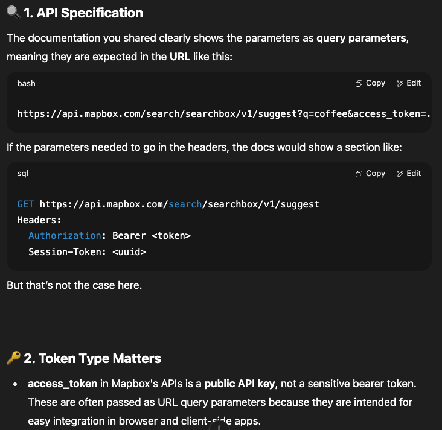

# Using Mapbox for the first time

## Geocoding API

## Search Box API

# Sources

- [Build your own customized map with Mapbox GL JS and Mapbox Studio](https://medium.com/@edanlewis/build-your-own-customized-map-with-mapbox-gl-js-and-mapbox-studio-98ca392ba65c) by Edan Lewis
