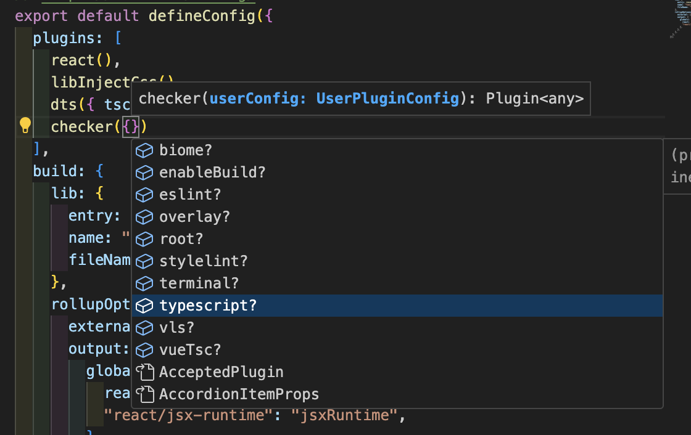
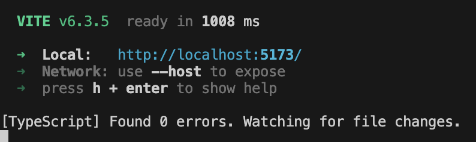
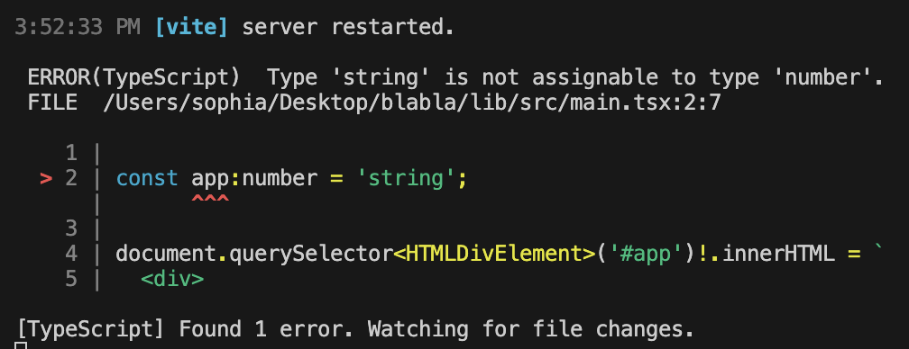
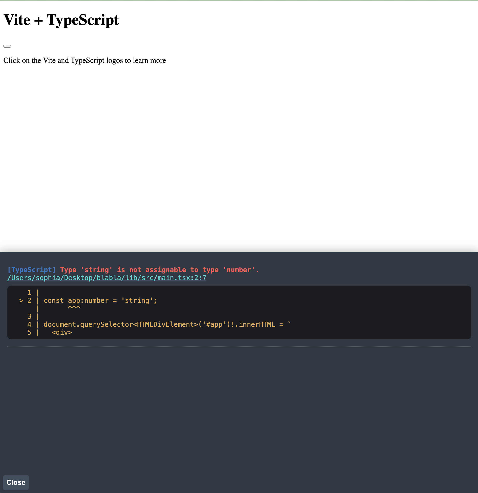

# Figuring out how to set up TypeScript

## What is TypeScript?

## Using TypeScript in VS Code

I use VS Code as my IDE. Fortunately, VS Code has a built-in TypeScript Compiler which works out of the box. The compiler analyzes not just your .ts/.tsx files but also your .js/.jsx files and tries to give basic support wherever it can. This is cool, because I had already wondered why IntelliSense helps me out in vanilla JS code.

So by default the compiler does its thing based on preconfigured rules and compiler settings. If I want to override it I can add a tsconfig.json file to my repo and tell the compiler how to behave, as it will automatically look for this file.

## Configurations

The first instinct is to look into the [official documentation](https://www.totaltypescript.com/tsconfig-cheat-sheet) options, only to suddenly scream internally when seeing the sheer endless scrolling for all the inumerous config keys available.

The second instinct is to close the tab and search for articles that help break everything down like Matt Pocock's [TSConfig Cheat Sheet](https://www.totaltypescript.com/tsconfig-cheat-sheet).

After reading the entire thing and then looking at the official documentation it appears not as daunting anymore. Sure, it's still a heck of a lot of options, but it is categorized like Matt does in his article.

And as with every new tool I won't be able to memorize everything by heart. That's also not the aim, but instead getting an understanding of the tool at hand and what it is capable of in case I ever need to tailor it to my needs down the road. Usually you configure the compiler once and then never touch it again. So there's no need for studying it anyways.

Nevertheless, I wanted to take a look at what I get when running `npx tsc --init`

...

//What is esnext?

https://www.youtube.com/watch?v=xQgBJIye5EU
https://www.youtube.com/watch?v=4zdBk6wisxc explains debugging

## Using TypeScript in frameworks

I wondered if I need the TS set-up if I create a project with a framework like Next.js or Vite which also provides templating. Usually these tools ask if you want to use TS in your project. They will then go ahead and create a `tsconfig.json` with everything configured to work out of the box with all the other tools I've selected, such as React or Vite.

Especially Vite and Next.js have their own build tools - Vite uses ESBuild, Next.js uses Babel - that can also transpile TS code. This happens before performing the rest of the build steps. Hence why one would think that setting up a tsconfig.json file would be redundant. And this is true to a certain extend.

> But there's a drawback. While Vite and other tools handle the actual transpilation of TypeScript to JavaScript, they don't provide type checking out of the box. This means that you could introduce errors into your code and Vite would continue running the dev server without telling you. It would even allow you to push errors into production, because it doesn't know any better.    So, we still need the TypeScript CLI in order to catch errors. But if Vite is transpiling our code, we don't need TypeScript to do it too. - [Total Typescript - Book Chapter 3](https://www.totaltypescript.com/books/total-typescript-essentials/typescript-in-the-development-pipeline#typescript-with-modern-frameworks)

So these build tools transpile TS code more efficiently, also because they don't perform the type checking step as this is not their main purpose.

But developers don't want to forgot type checking when running a dev server. Fortunately, Next.js provides type checking out of the box to improve development experience (DX). It runs Babel for transpilation and also runs `tsc` in a separate step for catching type checking errors which are then displayed in the console or the browser as this dreadful screen no dev really wants to see again.

You can achieve the same with Vite via plugins, such as `vite-plugin-checker`.

We can see that the plugin accepts different keys besides `typescript`

And once we add `{typescript: true}` to the plugin and run the dev server again, we can see it actually working:

After introducing an actual TS error in my `main.tsx` I expected it to throw an error in the console or by default throws them at you in an overlay in the browser (which is pretty neat, not gonna lie). But nothing happened. Only after explicitly passing the path to the tsconfig.json `tsconfigPath: "./tsconfig.app.json"` it starting spitting out errors:

You can also use `tsc` and explicitly run `tsc --noEmit --watch` but this doesn't give you the fancy browser overlay.

`tsc` is also needed if you want to create `d.ts` files which are the files' type definitions if you want to use the code in another project, such as a library. But of course there's another plugin called `dts` that also does this for you in the build process, so no need for running `tsc` at all. Sorry, `tsc`!.

More on Vite and TS in [this post](http://localhost:3000/vite_course).

# Sources

- [Total Typescript - The TS Config Cheat Sheet](https://www.totaltypescript.com/tsconfig-cheat-sheet) by Matt Pocock
- [Complimenting video](https://www.youtube.com/watch?v=eJXVEju3XLM&t=125s) by Matt Pocock
